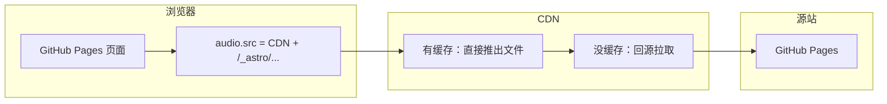

这个站是用 Astro 搭的，托管在 GitHub Pages 上，首页和导航里有个音乐播放器，歌都放在 `src/assets/music` 里。一开始我只是觉得「在内地打开好慢」，后来折腾了一圈 CDN、域名和免费证书，终于把播放跑顺了。这里记录一下这次实践经历，免得以后再踩坑。

## Table of contents

## 一、本次改动的动机

### 1.1 改动动机

GitHub 的服务器不在国内，跨境访问本来就随缘。我的歌都是打包进 `/_astro/` 下面的 MP3，**一首歌好几 MB 甚至十几 MB**，点播放等于浏览器要先拉一大坨数据下来。

### 1.2 为啥只加速音乐、不搞整站搬家

整站都挂到国内 CDN 或者上对象存储，要琢磨备案、DNS、账单，我暂时懒得一口气全上。折中方案是：**页面还是 GitHub Pages 出，只把音频的地址指到我自己的域名（走阿里云 CDN）**，让大文件尽量从边缘节点拿，命中缓存的时候体感会好很多。

## 二、补充知识

### 2.1 HTTP 和 HTTPS 差在哪？为啥 HTTPS 要扯上 SSL 证书？

- **HTTP**：浏览器和服务器之间传的东西大致是「明文在路上跑」（当然现在越来越少见了）。路上谁都能偷看、篡改，而且你很难确认对面**真的是**你要访问的那台服务器。
- **HTTPS**：在 HTTP 下面先套一层 **TLS（以前常叫 SSL）**。TLS 干两件大事：一是把通信内容**加密**，二是让浏览器能**验证对方身份**——「你说是 `foo.com`，拿证书出来对一下域名」。

**证书在这里干嘛用？**  
它相当于服务器给浏览器的一份「公钥 + 身份信息」，由浏览器信任的 CA（证书颁发机构）链签名过。浏览器用这套机制协商出会话密钥，后面的数据就加密传了。**没有合法证书，HTTPS 握手就会失败**，你看到的 `ERR_SSL_VERSION_OR_CIPHER_MISMATCH` 一类报错，很多时候就是这一层没谈拢（证书没配好、协议太老、链断了等等）。

那 **HTTP 为啥好像不用证书？**  
因为 HTTP 本来就不做这套「加密 + 强身份校验」，协议层没要求你出示证书。不是「HTTP 免费自带安全」，而是 **它压根没承诺安全**。现在 GitHub Pages、各大 CDN 默认都推 HTTPS，也是这个原因。

### 2.2 DV / OV / EV 是啥？个人站为啥申 DV 就够用？

- **DV（Domain Validation）**：只验证你**能控制这个域名**（例如改 DNS、上传验证文件）。签发快，阿里云等平台还有**免费 DV**，个人博客、静态资源加速用这个完全够。
- **OV / EV**：还要验公司实体、更严的身份，贵、慢，一般给企业官网、金融场景用。

我这种小博客 + CDN 加速域名，**申个免费 DV 就行**，没必要 EV（除非你真的需要那个绿色地址栏那一套，而且现在很多浏览器也不怎么突出显示了）。

### 2.3 CDN 和对象存储别搞混

- **对象存储（OSS 一类）**：像网盘 API，解决「文件放哪」。
- **CDN**：一堆边缘节点，解决「用户从哪近取」。

我没买 OSS，**源站直接填 GitHub Pages** 一样可以：CDN 没缓存时就去 GitHub 把同路径的文件拉回来。省钱，就是回源还是出国，速度会慢一些。

### 2.4 计费、Range 这些零碎概念

- 大文件多的时候，账单里**流量**往往是大头；按「请求次数」为主的计费更适合 API 那种一堆小响应的场景。
- **Range 回源**：浏览器播音频可能会分段拉（拖动进度更明显），CDN 开这个一般**不用改自己写的播放器代码**。

### 2.5 回源 Host：我当时最容易配错的一项

CDN 去源站拉文件时要带 HTTP `Host` 头。这里要填 **GitHub 认的那个主机名**（一般是 `你的用户名.github.io`），**不要**填成你自己 CDN 的加速域名——不然 GitHub 根本不知道你要哪个站，虚拟主机对不上号。

### 2.6 代码上修改

在 `musicPlaylist.ts` 里还是用 `import.meta.glob` 扫本地 mp3，构建出来本来是 `/_astro/xxx.hash.mp3` 这种路径。生产环境加个环境变量（`PUBLIC_MUSIC_CDN_ORIGIN`），把音频地址改成 **`https://加速域名` + 上面那条路径**，这样 CDN 和 GitHub 上**路径一致**，回源才能对上。

本地 `npm run dev` 用 `import.meta.env.DEV` 判断，**开发时一律不走 CDN**，继续从 Vite 读 `src/assets/music`。GitHub Actions 里在 build 那步把环境变量塞进去，部署上去的就是带 CDN 前缀的链接了。

## 三、实践中踩的坑

### 3.1 一堆 `ERR_SSL_VERSION_OR_CIPHER_MISMATCH`

此报错表示浏览器和CDN建立HTTPS时，TLS版本或加密套件对不上，原因是**根子在证书 / HTTPS 没配好**（没绑证书、证书域名不对、链不全、或者 CDN 上 HTTPS 没开利索）。去阿里云 CDN 控制台把**免费证书挂上、等它生效**，再用 SSL 检测网站或 `openssl s_client` 测试通过即可。

### 3.2 跨域、混合内容

页面在 `https://xxx.github.io`，音频在 `https://自己的域名`，算跨域。一般 `<audio>` 播个歌对 CORS 没 `fetch` 那么苛刻，但 CDN 上该配的 **CORS、Accept-Ranges** 还是配一下比较稳。还有：**页面是 HTTPS 的话，音频也必须 HTTPS**，否则混合内容直接被浏览器挡掉，怎么改前端都没用。

### 3.3 本地和线上分开

环境变量分流之后，我日常开发就专心调播放器逻辑；要验证 CDN 行为就得上**带环境变量的 build** 或者直接看线上，配合 Network 里看 MP3 是不是 200 / 206。

>CDN还是太折腾了，多得是能调的音乐api，没必要折腾自己。
