[Mermaid](https://mermaid.js.org/) 是一套基于 JavaScript 的图表工具：用接近 Markdown 的**纯文本**描述结构，在浏览器或构建流水线里渲染成 SVG（流程图、时序图、甘特图等）。中文入门与文档可参考 **[Mermaid 中文网 · 关于 Mermaid](https://mermaid.nodejs.cn/intro/)**。下文按「概念 → 全局书写规范 → **各图类型的语法要点（文字示例）** → **可运行图例** → 工程提示」组织：先看文字示例掌握写法，再对照围栏内的完整示例复制调试。

## Table of contents

## 1. 为什么选择 Mermaid

- **版本可控**：图与文档同属 Git，diff 可读。
- **渲染一致**：同一源码在不同集成环境里图形语义一致（终端读者看到的是图，不是画图工具的专有文件）。
- **类型丰富**：流程图、时序图、类图、状态图、甘特、饼图、旅程图、Git 图、思维导图等（具体能力随版本略有增减）。
- **集成面广**：静态站点、Wiki、IDE、CI 文档插件多有支持。

在本站（Astro + Markdown）中，` ```mermaid ` 围栏会在阅读页由客户端渲染为矢量图；写法与普通代码块相同，仅语言标记为 `mermaid`。

## 2. 基本写法：围栏与语句习惯

所有定义都写在 fenced code block 里，第一行通常是**图表类型关键字**，其后一行或多行遵循该类型的语法：

````markdown
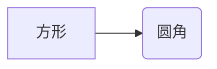
````

常用约定：

- **方向**：流程图可用 `TB`（上→下）、`BT`、`LR`、`RL`。
- **注释**：行首 `%%` 为单行注释。
- **文本中的括号**：节点文案若含特殊字符，优先用 `["双引号包裹"]` 或 `("圆括号节点语法")` 按文档处理。
- **链接**：流程图里可用 `-->|文本|` 或 `---` 表达关系。

### 2.1 全局书写规范

- **第一行**：必须是图表类型关键字（例如 `graph LR`、`sequenceDiagram`、`classDiagram`）；关键字前若写 YAML 前置块，只能用官方约定的 `---` 围栏格式，不要与普通 Markdown 标题混淆。
- **一行一意**：一条边、一个节点声明、一个参与者等尽量单独成行，便于 diff 与排错。
- **注释**：整行以 `%%` 开头为单行注释。
- **引号**：文案里含括号、竖线或与运算符混淆的字符时，用双引号包住整段，例如 `A["步骤（1）"]`、`X --> Y : "备注"`。
- **进阶**：可用 `%%{init: { … }}%%` 调整主题等；不同预览器支持度不同，以项目构建结果或 [Mermaid Live](https://mermaid.live/) 为准。

---

## 3. 流程图（Flowchart）

关键字：`flowchart` 或 **`graph`**（旧写法，仍广泛使用）。

### 语法要点

- **声明**：`graph TB` / `flowchart LR` —— `TB|BT|LR|RL` 控制整体走向。
- **节点形状**：`id[矩形]`、`id(圆角)`、`id{菱形}`、`id([体育场])`、`id[(圆柱)]`、`id[[子流程]]`。
- **连线**：`A --> B`；带文字 `A -->|是| B`；虚线 `A -.-> B`；粗链 `A ==> B`。
- **子图**：`subgraph 名称` …若干节点与边… `end`。
- **同一节点多次出现**：同一 `id` 复用表示同一对象。

### 3.1 方向与形状（图例）

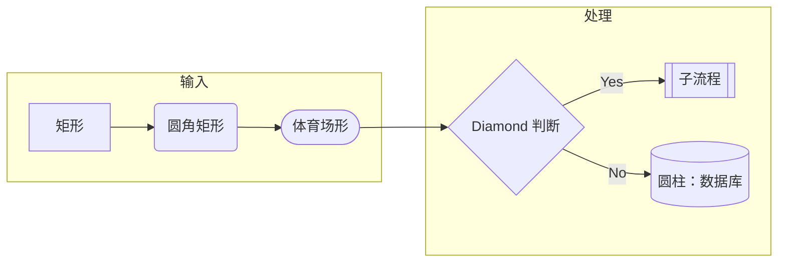

### 3.2 链路与样式提示（图例）

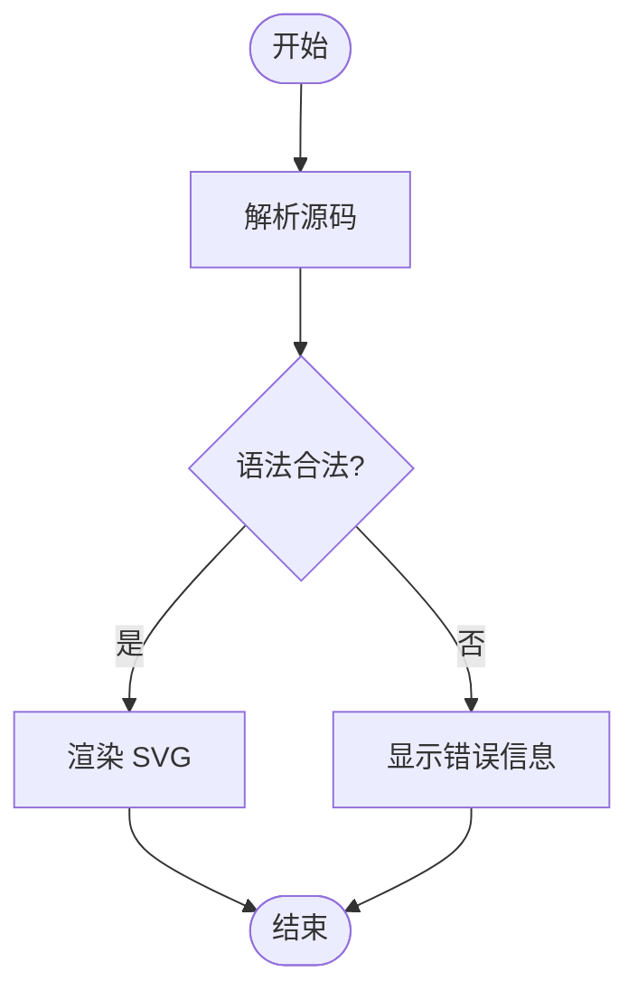

---

## 4. 时序图（Sequence Diagram）

描述参与者之间消息顺序，适合 API、组件交互。

### 语法要点

- **入口**：首行固定 `sequenceDiagram`。
- **参与者**：`participant 别名 as 显示名`、`actor 别名 as 显示名`；后续消息里用别名。
- **消息箭头**：`->` 实线无箭头、`->>` 实线三角、`-->>` 虚线三角、`->>+` / `-->>-` 带激活标记（与 `activate`/`deactivate` 二选一或混用，依风格）。
- **片段**：`loop` … `end`、`alt` … `else` … `end`、`opt` … `end`、`par` … `and` … `end`。
- **注释**：`Note left of A: 文本`、`Note over A,B: 文本`、`Note right of A: 文本`。
- **编号**：可选在第一层写 `autonumber`，自动给消息编号。

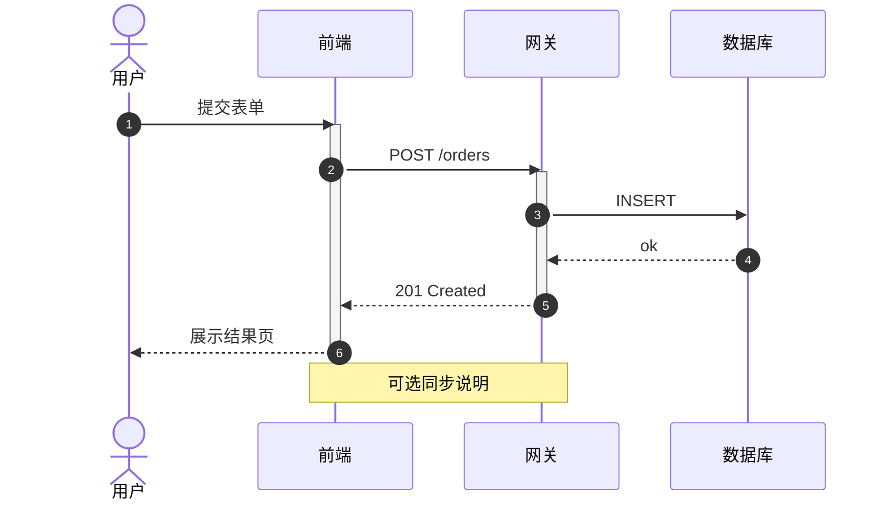

---

## 5. 类图（Class Diagram）

展示类型、继承、关联（简化示例）。

### 语法要点

- **入口**：首行 `classDiagram`。
- **类**：`class 类名 { 成员 }`；可见性前缀 `+` public、`-` private、`#` protected、`~` package。
- **关系**：继承 `<|--`、实现 `<|..`、关联 `-->`、聚合 `o--`、组合 `*--`，均可加标签如 `A "1" --> "n" B : 角色`。
- **注解**：独立一行 `<<interface>> 类名` 或 `<<enumeration>> 类名`；避免在部分管线中与 HTML 解析冲突时可改用文档推荐的单行类声明形式。
- **方法/属性**：方法写 `+方法名(参数) 返回类型`，属性写 `类型 字段名`。

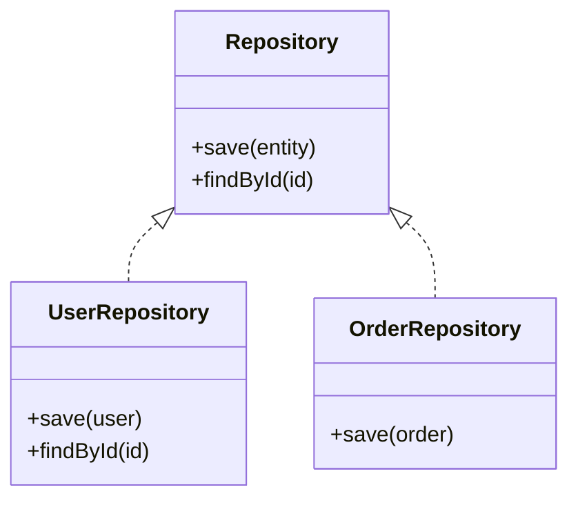

---

## 6. 状态图（State Diagram）

适合协议、订单、任务状态机。

### 语法要点

- **入口**：推荐使用 `stateDiagram-v2`（功能更全）。
- **起止**：初始 `[*]`，终止 `[*]`；中间状态用标识符如 `Idle`、`Processing`。
- **迁移**：`状态A --> 状态B : 事件或条件`；标签含空格或中文时建议加双引号：`S1 --> S2 : "提交审核"`。
- **复合状态**：`state 名称 { 子状态1 --> 子状态2 }`。
- **选择（可选）**：`state 岔路 <<choice>>` 配合多条出边表示分支（详见官方 stateDiagram 章节）。

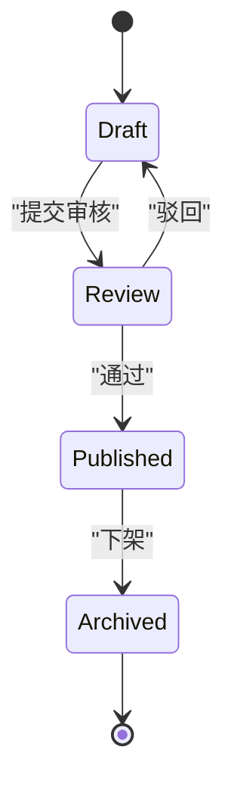

---

## 7. 实体关系图（ER）

数据库概念建模（部分方言标记为实验特性，以当前 Mermaid 版本为准）。

### 语法要点

- **入口**：首行 `erDiagram`。
- **关系行**：格式为「实体甲 … 实体乙 : 关系文案」，中间省略号处填入合法的基数记号组合（例如文档示例里的 ``||--o{``）；完整记号表见 [官方 ER 语法](https://mermaid.js.org/syntax/entityRelationshipDiagram.html)。
- **实体属性块**：在实体名后写 `{ … }`，块内每行一般为 **`类型 字段名`**，主键/外键可用 `PK`、`FK` 缀在字段名或单独约定（以当前版本文档为准）。
- **命名**：实体名避免空格，可用下划线 `LINE_ITEM`。

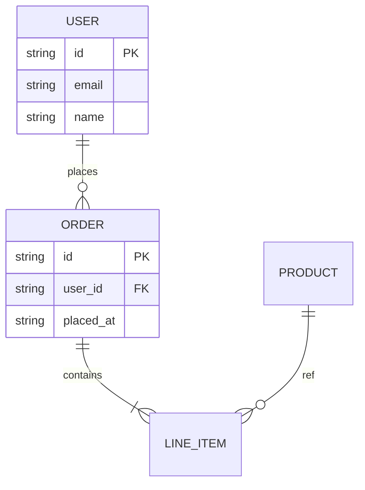

---

## 8. 甘特图（Gantt）

项目排期、里程碑。

### 语法要点

- **入口**：首行 `gantt`。
- **全局**：常用 `dateFormat YYYY-MM-DD`、`axisFormat` 控制坐标显示；`title` 设置标题。
- **分组**：`section 阶段名`，其下是该阶段的任务行。
- **任务行**：`任务描述 : id, 开始日期, 时长` 或 `任务描述 : id, after 前置id, 时长`；里程碑可用 `milestone, id, after 前置id, 0d` 等形式。
- **依赖**：通过 `after 任务id` 串联，同一文件内 `id` 唯一。

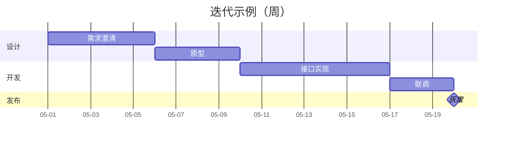

---

## 9. 饼图（Pie）

占比展示。

### 语法要点

- **入口**：`pie`；可选在同一行加 `showData` 以显示数值。
- **标题**：`title 饼图标题`（标题若含特殊字符可用引号）。
- **切片**：每行 `"切片名" : 数值`，数值为比例数字（同一图中通常用同一量纲）。
- **顺序**：切片书写顺序影响图例顺序，可不按数值大小排列。

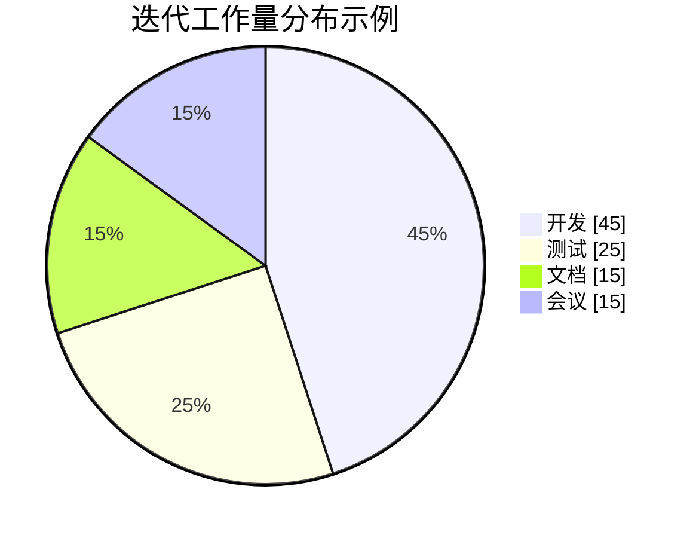

---

## 10. 用户旅程图（User Journey）

情感曲线与阶段并列呈现。

### 语法要点

- **入口**：首行 `journey`；可跟 `title …`。
- **阶段**：`section 阶段标题`，其下为该阶段内的若干「步骤行」。
- **步骤行**：`步骤描述: 分数: 参与者` —— 分数多为 1–5；多个参与者用逗号分隔，如 `3: 用户, 系统`。
- **语义**：同一 `section` 内自上而下表示时间或叙事顺序。

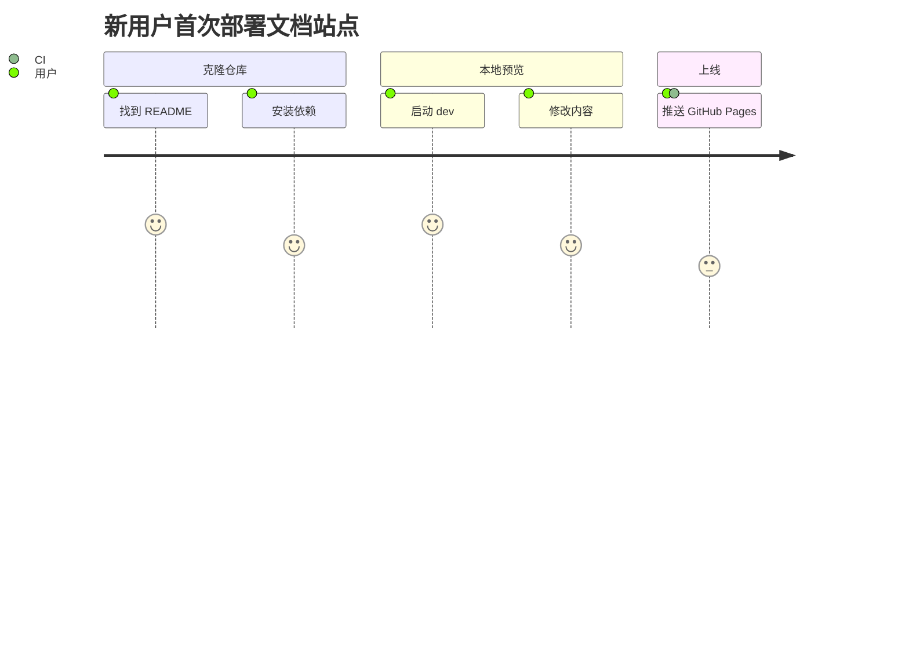

---

## 11. Git 图（Git Graph）

分支与合并叙事。

### 语法要点

- **入口**：首行 `gitGraph`。
- **提交**：`commit` 或 `commit id: "说明"`（说明字符串依版本支持略有差异，以官方为准）。
- **分支**：`branch 分支名`、`checkout 分支名`；首次 `commit` 后隐式在默认分支（多为 `main`），再 `branch` 拉出分支。
- **合并**：切回目标分支后 `merge 来源分支`；复杂叙事可链式多段 `commit` / `merge`。
- **顺序**：语句自上而下表示时间顺序。

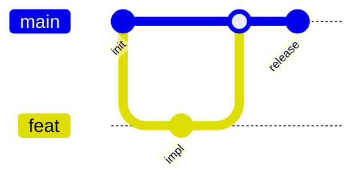

---

## 12. 思维导图（Mindmap）

层级提纲。

### 语法要点

- **入口**：首行 `mindmap`。
- **根节点**：`root((根文案))` 或 `root[根文案]` 等形式（圆角、括号样式任选其一，与版本示例对齐）。
- **层级**：子节点比父级**多一级缩进**（空格）；同级对齐；子节点中文或含空格时可用双引号：`"子节点"`。
- **深度**：可多级嵌套；过深时考虑拆图以保持可读性。

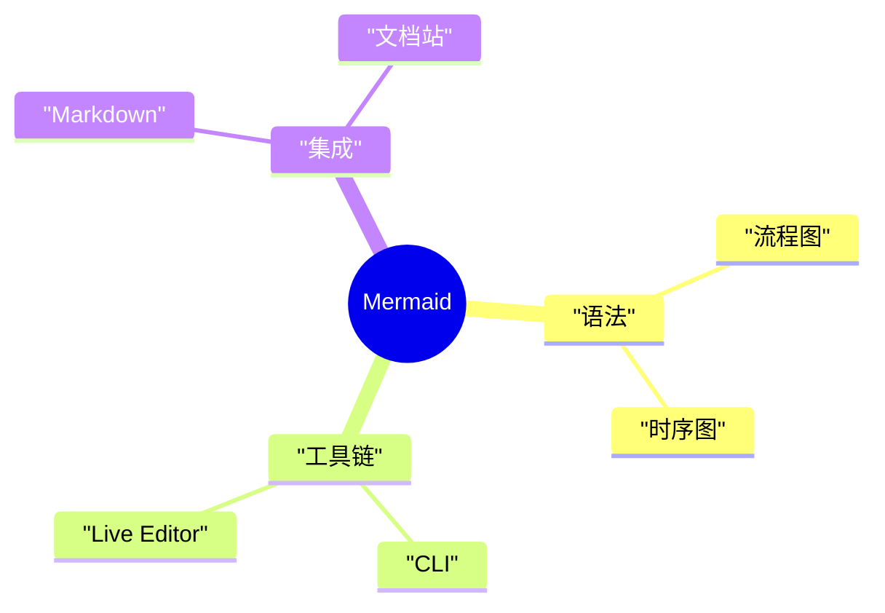

> 若使用部分旧版 Mermaid 的本地预览，对「子节点」用**双引号**包一层中文，可减少分词问题；子层缩进比 `root` 多一级即可。

---

## 13. 时间线（Timeline）

按时间排列事件。

### 语法要点

- **入口**：首行 `timeline`；可选 `title …`。
- **条目**：每行 `时期或年份 : 说明文字`；同一年可多行表示并列事件（依官方示例书写）。
- **顺序**：自上而下为时间推进。

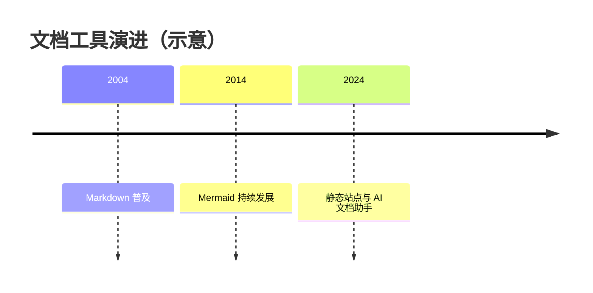

---

## 14. 象限图（Quadrant Chart）

四象限定位。**象限图依赖较新的 Mermaid（约 10.3+）**；若只用 VS Code / 旧版 Markdown 预览扩展，常会直接报错或空白，属预览器内核过旧，而非语法抄写错误。可在 [Mermaid Live Editor](https://mermaid.live/) 或本站文章页核对。

### 语法要点

- **入口**：首行 `quadrantChart`。
- **标题与轴**：`title …`；`x-axis 左文案 --> 右文案`、`y-axis 下文案 --> 上文案`（箭头表示轴方向语义）。
- **象限标签**：`quadrant-1` … `quadrant-4` 各一行，文字为该象限含义。
- **数据点**：`"点名称" : [x, y]`，坐标一般为 0–1 的相对位置；点名含空格或中文建议加双引号。
- **兼容性**：旧预览器无此图表类型时整条围栏会失败，与书写是否正确无关。

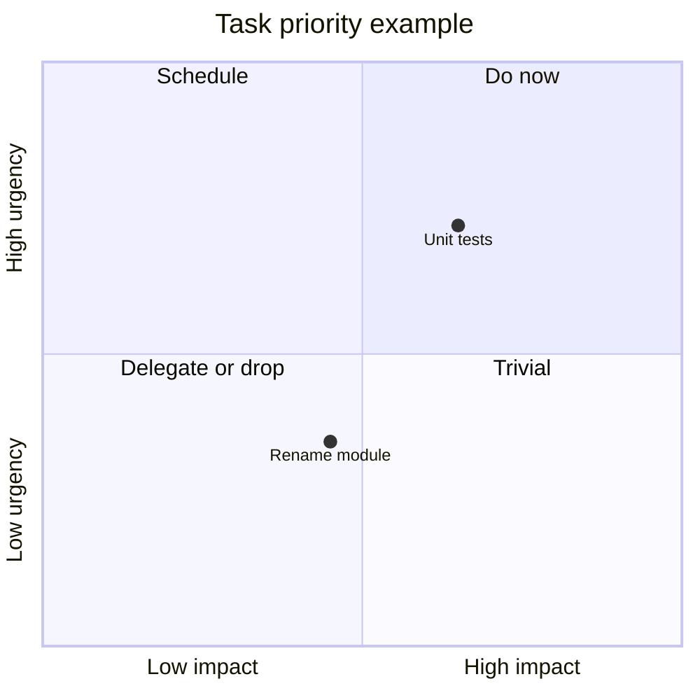

---

## 15. 主题、安全与工程向提示

- **主题**：集成时常用 `mermaid.initialize({ theme: 'default' | 'dark' | 'forest' | ... })`；本站阅读页会跟随站点浅/深色切换。
- **安全**：对外展示**用户提交的** Mermaid 时需注意 XSS 与脚本注入；公开站可参考官方文档中的 **securityLevel**、沙箱方案说明（详见 [Mermaid 中文网 · 关于 Mermaid](https://mermaid.nodejs.cn/intro/) 安全章节及英文主站）。
- **与 Markdown 的关系**：Mermaid **不是**通用 Markdown 超集；它是独立语法块，由渲染器识别 ` ```mermaid ` 后交给 Mermaid 引擎。
- **块图、雷达图、架构图等**：新版本会持续增加图表类型；若某种图在本页未列出，请以当前安装的 `mermaid` 版本为准，并查阅官方「图表语法」索引。

---

## 16. 小结与延伸阅读

| 能力           | 典型用途           |
| -------------- | ------------------ |
| 流程图 / graph | 业务与程序分支     |
| 时序图         | 调用链、协议交互   |
| 类图 / ER      | 结构与数据模型     |
| 甘特 / 饼图    | 排期与占比         |
| Git / Journey  | 协作叙事与体验路径 |

- 中文介绍与导航：**[Mermaid 中文网 · 关于 Mermaid](https://mermaid.nodejs.cn/intro/)**
- 英文主站（语法细节与更新）：[https://mermaid.js.org/](https://mermaid.js.org/)

掌握「关键字 + 少量书写习惯」后，大部分图表都可以在几分钟内从文本迭代出来；与文档放在一起维护，比单独维护一张 PNG 更可持续。
