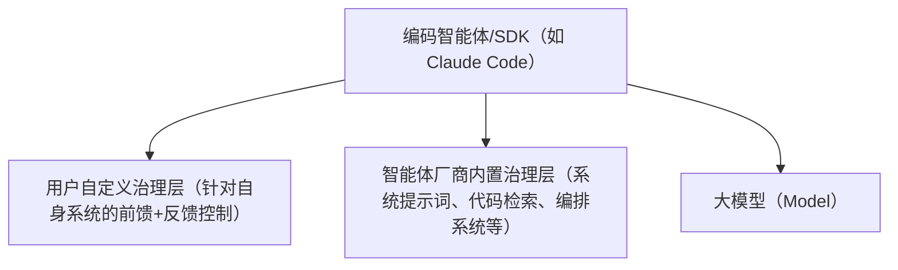
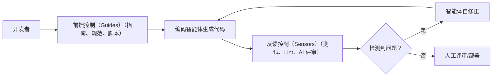
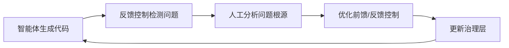
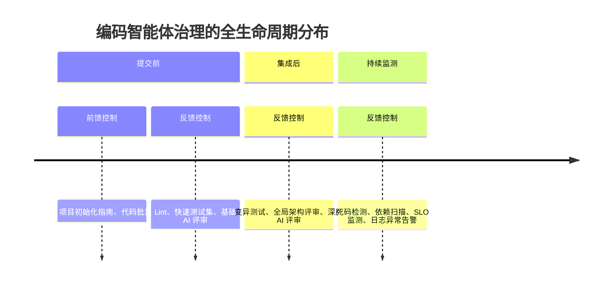
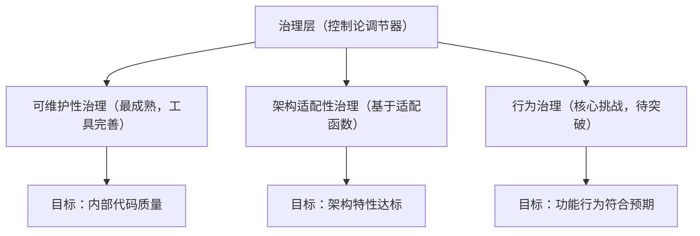
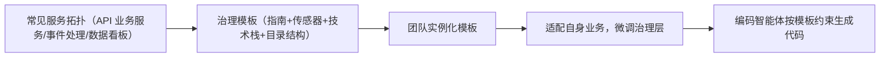

> **原文**：Birgitta Böckeler，[Harness Engineering](https://martinfowler.com/articles/harness-engineering.html)（Martin Fowler，原文首发约 2026 年 4 月 2 日）。本文为学习整理，非官方译文。

作为软件工程师，我们对 AI 生成的代码天然存在信任壁垒：大语言模型（LLMs）具有非确定性、不了解项目上下文、并非真正理解代码，而只是基于 Token 进行生成。为了让编码智能体在更少人工监督下可靠工作，我们需要建立对其输出结果的信心。本文结合上下文工程与治理工程（Harness Engineering）的前沿理念，提供一套可落地的心智模型，帮助构建这种信任。

## 一、核心定义：什么是 Harness（治理层）

在 AI 智能体领域，Harness（治理层）已成为一个简写术语，指代智能体中除模型本身以外的所有部分，即：

**智能体 = 大模型 + 治理层**

这个定义范围较广，在编码智能体的特定场景下，我们可将其进一步明确为两类治理层，具体关系如下（对应原文图 1）：

### 图例 1：编码智能体中的治理层分类

#### 1.1 内置治理层

由编码智能体的构建者提供，是智能体自带的基础能力，无需用户额外开发，例如系统提示词、代码搜索工具、复杂的任务编排系统等。

#### 1.2 用户自定义外层治理层

由智能体使用者（开发者/团队）针对自身业务场景、系统架构搭建的专属控制体系，也是本文的核心讨论对象。

一个设计良好的外层治理层，核心要实现两大目标：

- 提升智能体「一次生成正确代码」的概率，减少初始错误；
- 构建自修正反馈闭环，在问题到达人工评审前，自动修正尽可能多的问题，最终降低评审工作量、提升系统质量，同时减少 Token 浪费。

## 二、核心机制：前馈控制（Guides）与反馈控制（Sensors）

治理编码智能体的核心逻辑，是同时做到「提前规避错误」与「事后检测修正」，这对应两种核心控制机制，二者缺一不可。

### 2.1 前馈控制（Guides）——事前引导，预防错误

在智能体生成代码 _之前_ 介入，通过预设规则、指南，引导智能体的行为，提前规避常见错误，提升首稿输出质量。

#### 核心作用

主动预判智能体可能出现的问题，从源头减少错误，避免智能体反复踩坑。

#### 缺失风险

若只有反馈控制、没有前馈控制，智能体会陷入「重复犯同样错误」的循环，无法从源头提升效率。

### 2.2 反馈控制（Sensors）——事后监测，自修正

在智能体生成代码 _之后_，通过各类监测工具（传感器）捕捉输出问题，生成信号并反馈给智能体，帮助其自动修正错误。

#### 最优实践

反馈信号需「适配大模型理解」，例如自定义 Lint 工具输出的消息中，不仅指出错误，还包含具体的修复指令——这属于一种正向的提示注入（Prompt Injection）。

#### 缺失风险

若只有前馈控制、没有反馈控制，智能体无法验证自身输出是否符合规则，只能「盲执行」，无法迭代优化。

### 图例 2：前馈与反馈控制的协同逻辑

## 三、执行类型：计算型（Computational）vs 推理型（Inferential）

无论是前馈控制还是反馈控制，都可按「执行方式」分为两类，二者适配不同的场景，需结合使用。

### 3.1 计算型控制（Computational）

- **核心特点**：确定性强、速度快，由 CPU 执行，结果可复现；
- **典型工具**：单元测试、Lint 检查、类型检查、架构结构分析（如 ArchUnit）；
- **适用场景**：可快速运行，适合在每次代码变更时执行，作为基础质量把关。

### 3.2 推理型控制（Inferential）

- **核心特点**：基于语义分析，非确定性，成本较高，由 GPU/NPU 执行；
- **典型工具**：AI 代码评审、「大模型作为法官」（LLM as judge）、语义重复检测；
- **适用场景**：处理复杂的语义判断，适合深度质量把关，无需在每次变更时执行。

### 3.3 典型场景对照表（原文核心示例）

| 应用场景       | 控制方向 | 执行类型 | 实现示例                                        |
| -------------- | -------- | -------- | ----------------------------------------------- |
| 编码规范约束   | 前馈     | 推理型   | AGENTS.md、技能配置（Skills）                   |
| 新项目初始化指南 | 前馈   | 混合型   | 包含指令的技能配置 + 启动脚本                   |
| 代码批量修改   | 前馈     | 计算型   | 支持 OpenRewrite recipes 的工具               |
| 架构边界测试   | 反馈     | 计算型   | pre-commit 钩子 + ArchUnit 测试（检查模块边界违规） |
| 代码评审指南   | 反馈     | 推理型   | 技能配置（Skills）                            |

## 四、关键关联：治理工程与上下文工程

上下文工程（Context Engineering）的核心作用，是为智能体提供「获取指南和传感器」的能力——让智能体知道「遵循什么规则」「如何接收反馈」。

而**编码智能体的用户治理工程，是上下文工程的一种特定实现**：它聚焦于「编码场景」，将上下文工程的理念，落地为具体的前馈/反馈控制体系，帮助开发者建立对编码智能体的信任。

## 五、人工角色与迭代闭环：持续优化治理层

治理层并非「一劳永逸」，而是需要持续迭代，其中人工的核心作用是「引导迭代」，形成完整的 steering loop（steering 闭环）。

### 5.1 人工的核心职责

当同一问题反复出现时，优化前馈控制（如补充更细致的指南）或反馈控制（如新增针对性传感器），让问题不再重复发生。

### 5.2 AI 辅助治理层构建

编码智能体本身也可用于优化治理层，降低人工成本，例如：

- 自动编写结构测试（如 ArchUnit 测试）；
- 从代码中观察到的模式，提炼出治理规则；
- 搭建自定义 Lint 工具；
- 通过代码库考古，生成最佳实践指南。

### 图例 3：治理层迭代闭环

## 六、质量左移：全生命周期治理策略

持续交付的核心原则之一是「质量左移」——问题发现得越早，修复成本越低。治理控制需按「成本、速度、重要性」，分布在研发全生命周期中。

### 6.1 三个关键阶段的治理配置

- **提交前（高速、必跑）**：执行低成本、快速的计算型控制，如 Lint、快速测试集、基础 AI 代码评审，确保每次提交的基础质量；
- **集成后（高成本、深度检查）**：执行推理型控制或高成本计算型控制，如变异测试、全局架构级代码评审，覆盖提交前未检测到的深层问题；
- **持续监测（脱离单次变更周期）**：针对代码库和运行时进行长期监测，捕捉「持续漂移」，如死码检测、测试覆盖率质量分析、依赖扫描、SLO 退化监测、日志异常告警。

### 图例 4：研发全生命周期的治理分布

## 七、治理层的三大分类（按目标划分）

治理层如同「控制论调节器」，核心是将代码库导向「期望状态」。按治理目标，可分为三类，各自的成熟度和挑战不同。

### 7.1 可维护性治理（最成熟）

聚焦于代码的内部质量和可维护性，是目前最容易落地的治理类型，已有大量成熟工具支持。

- 计算型传感器：可可靠捕获重复代码、圈复杂度过高、测试覆盖率缺失、架构漂移、编码风格违规等问题；
- 推理型传感器：可部分处理语义重复、冗余测试、过度设计等需要语义判断的问题，但成本高、非确定性强，不适合每次提交都执行；
- 局限：无法可靠捕获「需求误解、过度设计、问题误判」等高影响问题——若人工未明确需求，任何传感器都无法判断代码是否「符合预期」。

### 7.2 架构适配性治理

核心是定义并校验应用的架构特性，本质是「适配函数（Fitness Functions）」的落地——确保代码符合预设的架构要求。

#### 典型示例

- 前馈控制：明确性能需求的技能配置、可观测性编码规范（如日志标准）；
- 反馈控制：性能测试（验证性能是否达标）、日志质量检查（验证可观测性是否符合要求）。

### 7.3 行为治理（核心挑战）

确保代码的「功能行为符合预期」，是目前最难突破的治理类型——也是编码智能体实现高自主性的关键瓶颈。

#### 现状

目前大多数团队的做法是：前馈提供功能规格（从简短提示到多文件描述），反馈依赖「AI 生成测试套件通过」「测试覆盖率达标」，并结合人工测试——但这种方式过度信任 AI 生成的测试，可靠性不足。

#### 探索方向

Approved Fixtures Pattern（认证夹具模式）：通过预设认证的测试夹具，提升测试可靠性，但目前仅能在部分场景适用，尚未成为通用解决方案。

### 图例 5：三大治理类型对比

## 八、可治理性（Harnessability）：治理层的落地前提

并非所有代码库都适合搭建治理层，代码库的「可治理性」取决于其自身特性——这些特性决定了治理层的搭建难度和效果。

### 8.1 环境固有适配性（Ambient Affordances）

这一概念由作者同事 Ned Letcher 提出，指「环境本身的结构特性，让智能体更易解读、导航与处理」，是可治理性的核心基础。

#### 新项目 vs 遗留系统

- 新项目：可从第一天就植入可治理性——通过技术选型、架构设计，决定代码库的可治理程度；
- 遗留系统：技术债越多，越需要治理层，但搭建难度越大（缺乏清晰的模块边界、规范等）。

### 8.2 治理模板（Harness Templates）

企业中 80% 的服务都属于常见拓扑（如 API 业务服务、事件处理服务、数据看板），这些拓扑可沉淀为「治理模板」——包含该拓扑对应的指南、传感器、技术栈、目录结构的标准化包。

#### 核心价值

符合阿什比必要多样性定律（Ashby's Law）：大模型生成的内容多样性极高，而固定拓扑可「缩小生成空间」，让全面治理更易实现（调节器的多样性需不低于被调节系统的多样性）。

#### 挑战

与服务模板类似，治理模板会面临版本同步问题——团队实例化模板后，易与上游模板的更新脱节，且非确定性的指南和传感器更难测试。

### 图例 6：治理模板的落地逻辑

## 九、人的不可替代性：隐性治理层的价值

开发者自身的经验、直觉和组织共识，是一种「隐性治理层」——这是编码智能体完全不具备的，也是治理层无法完全替代的。

### 9.1 开发者的隐性治理能力

- 掌握编码规范和最佳实践，能直觉判断「什么是好代码」；
- 经历过复杂系统的认知痛苦，能规避高风险设计；
- 有责任意识（代码提交有自己的署名），会主动把控质量；
- 了解组织目标，知道「技术债的容忍度」「团队的做事方式」，能平衡技术与业务。

### 9.2 治理层的核心目标

治理层的本质，是将开发者的隐性经验「显性化、工程化」，但它无法完全替代人工——其核心目标不是「消除人工输入」，而是「将人工输入导向最有价值的地方」（如需求澄清、关键决策），减少无效的重复评审工作。

## 十、现状与开放问题

本文提出的心智模型，已在业界有诸多实践落地，核心价值是将讨论从「单一功能（如技能、代码检索）」提升到「系统性设计控制体系」，帮助开发者真正建立对编码智能体的信任。

### 10.1 业界实践案例

- OpenAI：用自定义 Lint 和结构测试保障分层架构，定期「垃圾回收」检测代码漂移，结论是「当前最大挑战是设计环境、反馈闭环和控制系统」；
- Stripe：通过基于启发式的 pre-push 钩子，根据代码变更自动运行相关 Lint，强调「反馈左移」，并通过「蓝图」将反馈传感器整合到智能体工作流；
- Thoughtworks：用计算型+推理型传感器治理架构漂移，例如通过智能体+自定义 Lint 提升 API 质量，用「清洁工军团」（janitor army）提升代码质量。

### 10.2 开放问题（待探索）

- 治理层膨胀时，如何保持指南与传感器的一致性，避免相互矛盾？
- 当指令与反馈信号指向不同方向时，如何让智能体做出合理权衡？
- 如何评估治理层的覆盖度和质量？（类似代码覆盖率、变异测试对测试的评估）
- 如何将分散在研发各环节的前馈/反馈控制，整合为统一、可管理的系统？

核心结论：构建外层治理层，已成为一种「持续工程实践」，而非一次性配置——它需要随着代码库、业务需求和智能体能力的进化，持续迭代优化。

## 致谢（原文致谢）

特别感谢 Doppler 团队在技术雷达会议上的精彩讨论，尤其是 Kief Morris 提出的控制论理念；感谢 Ned Letcher、Chris Ford 和 Ben O'Mahoney 关于「治理层定义」的深入交流；感谢 Matteo Vaccari 在行为治理方面的见解；同时感谢所有阅读初稿并提供宝贵反馈的人：Christoph Burgmer、Jörn Dinkla、Michael Feathers、Karrtik Iyer、Swapnil Phulse、Paul Sobocinski、Zhenjia Zhou。

本文使用 GenAI（Claude 和 Claude Code）进行研究、整合现有笔记中的相关理念，并优化语言表达。

## 补充说明

本文是作者对 2026 年 2 月发布的初始备忘录的更新与完善，原备忘录 URL 已重定向至英文原文，该文是更全面、更完善的参考资源。

> （注：本站为学习笔记整理；正文整理过程可能使用 AI 辅助。）
